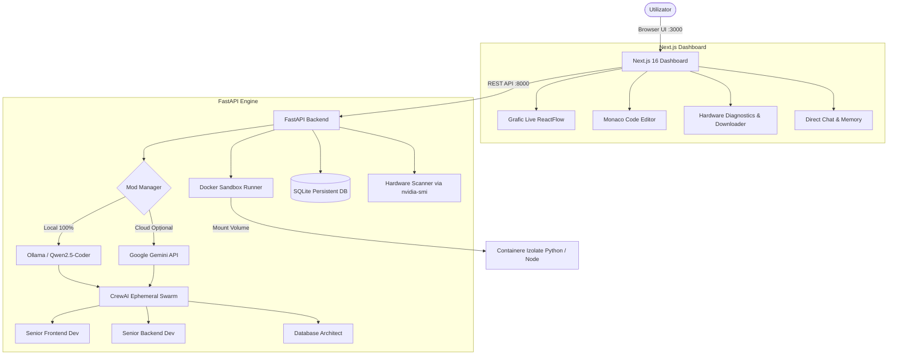

<div align="center">

  # ⚡ CoreForge 2026
  **Platformă Autonomă de Orchestrare Multi-Agent & Mediu Integrat de Dezvoltare (IDE) — 100% Local & Decuplat de Cloud**

  [](https://github.com)
  [](https://github.com)
  [-emerald?style=flat-square&logo=nvidia)](https://github.com)
  [-black?style=flat-square&logo=next.js)](https://nextjs.org)
  [](https://fastapi.tiangolo.com)
  [](LICENSE)

  [Prezentare Funcționalități (FEATURES.md)](FEATURES.md) · [Ghid Raportare Probleme](.github/ISSUE_TEMPLATE/bug_report.md) · [Contribuie](.github/PULL_REQUEST_TEMPLATE.md)

</div>

---

## 🌟 Ce este CoreForge 2026?

**CoreForge** este o platformă completă de dezvoltare software bazată pe inteligență artificială, concepută pentru a funcționa **complet pe laptopul tău (100% Local)**, fără taxe de utilizare, fără abonamente cloud și fără dependență de Gemini sau OpenAI API.

Folosind o arhitectură ierarhică **CrewAI** susținută de accelerare **NVIDIA CUDA** prin **Ollama**, CoreForge transformă o simplă cerință în limbaj natural într-un proiect software complet (frontend, backend, baze de date, scripturi de lansare), pe care îl poți vizualiza în **Monaco Editor (VSCode)** și rula într-un **Docker Sandbox securizat**.

---

## 🚀 Funcționalități Cheie (Highlights)

- 🏠 **100% Local & Zero-Cost:** Înlocuiește complet Gemini API cu un Manager local (ex: `Qwen 2.5 Coder 7B` sau `Llama 3.1 8B`). Datele tale nu părăsesc niciodată laptopul.
- 🩺 **Diagnostic Hardware & Scor de Compatibilitate:** Detectează automat memoria RAM și placa grafică dedicată (ex: NVIDIA RTX 4060) și afișează un procent de compatibilitate (% OK) pentru fiecare model AI.
- 📥 **Descărcare Integrată de Modele (1-Click Downloader):** Descarcă modelele direct din interfață, cu bară de progres live și estimare de viteză prin stream Ollama.
- 🤖 **Orchestrare Ierarhică & Agenți Efemeri:** Managerul analizează cerința, creează dinamic echipa de specialiști necesari (React Developer, Python Engineer, QA Tester) și le distribuie sarcini atomice.
- ⚡ **Vizualizare ReactFlow în Timp Real:** Grafic dinamic de noduri care pulsează și afișează ce agent gândește și scrie cod în fiecare moment.
- 💻 **Monaco Code Editor (VSCode IDE):** Editor de cod profesional integrat direct în browser, cu selector de fișiere și istoric al tuturor aplicațiilor generate.
- 🛡️ **Docker Sandbox Runner:** Rulează codul generat într-un container Linux temporar și izolat, afișând terminalul de ieșire live în dashboard.
- 💬 **Direct Chat cu Memorie Persistentă:** Mod conversațional stil ChatGPT pentru a discuta rapid cu oricare model local, cu suport pentru sesiuni multiple în SQLite.
- 📊 **Token Analytics & Cost Intelligence (100% Local):** Urmărire precisă a consumului de tokeni (input, output, tok/s, latență) pentru fiecare mesaj de chat și comandă de roi de agenți (swarm), cu grafice cronologice stivuite, distribuție pe modele și comparație de costuri economisite vs GPT-4o, Claude 3.5 și Gemini 1.5 Pro ($0.00 cheltuit).
- 🛠️ **CrewAI Tool Integration:** Agenții pot folosi instrumente native: `FileReadTool`, `DirectoryReadTool` și `ScrapeWebsiteTool`.

---

## 🏗️ Arhitectura Sistemului



---

## 🛠️ Tehnologii Utilizate

| Componentă | Tehnologie | Rol & Caracteristici |
| :--- | :--- | :--- |
| **Frontend** | React 19, Next.js 16 (Turbopack), Tailwind CSS | Dashboard ultra-rapid, responsive, cu temă dark/neon |
| **Backend** | Python 3.12, FastAPI, Pydantic, Uvicorn | API asincron, thread pooling, procesare regex |
| **Orchestrare AI** | CrewAI, LangChain, Ollama | Ierarhie multi-agent, delegare automată de sarcini |
| **Unelte Agenți** | `crewai-tools` | Inspecție de fișiere, navigare directoare, web scraping |
| **Accelerare GPU** | NVIDIA CUDA, `nvidia-smi` | Inferență locală la viteze maxime în VRAM |
| **Editor de Cod** | `@monaco-editor/react` | Experiență completă de editare tip Visual Studio Code |
| **Izolare Cod** | Docker SDK for Python | Execuție securizată de cod în containere alpine/slim |
| **Bază de Date** | SQLite3 cu WAL Mode | Persistență istoric chat, sesiuni, agenți și setări |

---

## 🚀 Ghid de Instalare și Rulare Rapidă

### Cerințe Preliminare
1. **Sistem de Operare:** Linux (Ubuntu recomandat) sau Windows 11 (WSL2).
2. **Python:** >= 3.10 (recomandat Python 3.12).
3. **Node.js:** >= 18 (recomandat Node 20 LTS).
4. **Ollama:** Instalat și pornit (`ollama serve`).
5. **Docker:** Instalat pentru funcționalitatea de Sandbox.
6. **Placă Video (Opțional dar Recomandat):** NVIDIA GPU cu minim 6–8 GB VRAM (ex: RTX 3060, 4060 sau superioară).

---

### Opțiunea 1: Rulare Locală (Startup Script)

```bash
# 1. Clonează depozitul
git clone https://github.com/andrei-morar/CoreForge.git
cd CoreForge

# 2. Configurează mediul virtual Python
python3 -m venv agent_env
source agent_env/bin/activate
pip install -r requirements.txt # sau instalează pachetele din main.py

# 3. Instalează dependențele frontend
cd ai-dashboard
npm install
cd ..

# 4. Pornește întregul studio printr-o singură comandă
./start_coreforge.sh
```

Aplicația va fi accesibilă la:
- 🌐 **Frontend Dashboard:** [http://localhost:3000](http://localhost:3000)
- 🔌 **FastAPI Backend Swagger Docs:** [http://localhost:8000/docs](http://localhost:8000/docs)

---

### Opțiunea 2: Rulare prin Docker Compose (Cu suport GPU)

```bash
# Pornește Ollama, Backend-ul și Frontend-ul într-un stack complet
docker compose up --build
```

---

## ⚙️ Configurare Mod 100% Local (Fără Chei Cloud)

Pentru a folosi CoreForge fără niciun fel de costuri:
1. Deschide dashboard-ul la `http://localhost:3000`.
2. Mergi în tabul **Local AI & Hardware**.
3. În secțiunea *Configurare Team Manager*, comută pe **🏠 100% Local (Fără Costuri)**.
4. Selectează modelul dorit (recomandat: `qwen2.5-coder:latest` sau `llama3.1:latest`).
5. Dacă nu ai modelul instalat, apasă pe **Descarcă Model (1-Click)** chiar din catalogul afișat!

---

## 📂 Structura Proiectului

```
CoreForge/
├── .github/                      # Ecosistem GitHub CI/CD & Workflows
│   ├── workflows/ci.yml         # Pipeline automat de teste și build
│   ├── workflows/release.yml    # Compilare automată .exe (Windows) și .deb (Ubuntu)
│   ├── ISSUE_TEMPLATE/          # Șabloane pentru bug report & feature request
│   └── PULL_REQUEST_TEMPLATE.md # Șablon pentru contribuții
├── ai-dashboard/                 # Frontend Next.js 16 (Turbopack, Monaco Editor, ReactFlow)
├── desktop/                      # Wrapper Desktop Electron (NSIS installer .exe, .deb)
├── docs/                         # Documentație tehnică, arhitectură și planuri de sarcini
├── examples/                     # Aplicații demonstrative de referință (ex: flask_todo_app)
├── generations/                  # Aplicațiile de cod generate autonom de către agenți
├── scripts/                      # Utilitare automate (build_desktop.sh, push_to_github.sh)
├── tests/                        # Suită completă de 15 teste automate pytest
├── docker-compose.yml            # Orchestrare multi-container Docker cu suport GPU
├── Dockerfile.backend            # Build containerizat backend FastAPI
├── main.py                       # Nucleu FastAPI, orchestrare CrewAI și SQLite
├── start_coreforge.sh            # Script de pornire rapidă într-un singur pas
├── FEATURES.md                   # Catalogul complet al funcționalităților
└── README.md                     # Documentația oficială a proiectului
```

---

## 🗺️ Foaie de Parcurs (Roadmap)

- [x] **Faza 1:** Agent Customization Hub cu salvare în SQLite.
- [x] **Faza 2:** Monaco Code Editor integrat cu file explorer.
- [x] **Faza 3:** Grafic animat de noduri în timp real cu ReactFlow.
- [x] **Faza 4:** Docker Execution Sandbox cu ieșire de terminal live.
- [x] **Faza 5:** Integrare unelte `crewai-tools` (FileRead, DirectoryRead, WebScraper).
- [x] **Faza 6 & 6.5:** Direct Chat tip ChatGPT cu memorie persistentă pe sesiuni.
- [x] **Faza 7:** Filtrare regex a blocurilor de cod și instrucțiuni automate de rulare.
- [x] **Faza 8:** Orchestrare dinamică cu agenți efemeri construiți la cerere.
- [x] **Faza 9:** Istoric de proiecte în stil VSCode și denumiri lizibile.
- [x] **Faza 10:** Mod 100% Local (Zero-Cloud), Hardware Scanner & In-App Model Downloader.
- [x] **Faza 10.5:** Statistici & Monitorizare Tokeni Locală (Token Analytics, Viteze tok/s, Grafice & Comparație Costuri Cloud).
- [ ] **Faza 11:** Împachetare ca aplicație Desktop nativă standalone (`.exe` pentru Windows și `.deb` / `.AppImage` pentru Ubuntu).
- [ ] **Faza 12:** Streaming de token-uri prin WebSockets / Server-Sent Events (SSE).

---

## 📄 Licență

Acest proiect este licențiat sub termenii licenței **MIT**. Consultați fișierul `LICENSE` pentru detalii.
