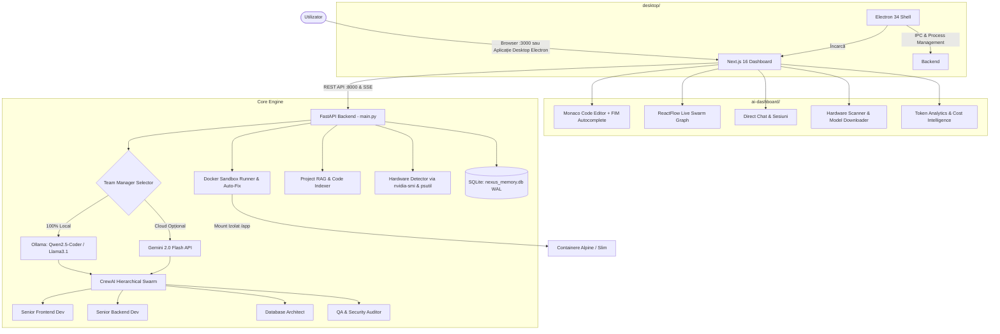

# 🏛️ CoreForge 2026 — Documentație Tehnică de Arhitectură

> **CoreForge 2026** este o platformă autonomă de dezvoltare software bazată pe agenți AI, concepută pentru a funcționa **100% Local (Zero-Cloud Mode)**, fără costuri de abonament sau dependențe obligatorii de API-uri terțe (OpenAI, Anthropic sau Gemini).

---

## 🏗️ 1. Diagramă Arhitecturală Generală

---

## ⚙️ 2. Componente Backend (`main.py`)

### 2.1 Orchestrare Ierarhică CrewAI & Agenți Efemeri
- **Team Manager**: Alimentat în mod implicit de un model local instalat în Ollama (`qwen2.5-coder:latest` sau `llama3.1:latest`).
- **Descompunere Dinamică**: Managerul analizează cerința în limbaj natural și creează o echipă dinamică de agenți specializați (*Frontend*, *Backend*, *Baze de date*, *QA*), atribuind fiecăruia modelul optim și uneltele necesare (`FileReadTool`, `DirectoryReadTool`, `ScrapeWebsiteTool`).
- **Ciclu de Viață Efemer**: După ce codul este generat și validat, agenții sunt distruși automat pentru a elibera memoria VRAM a plăcii grafice.

### 2.2 FIM Code Autocomplete (Fill-In-The-Middle)
- Endpoint: `POST /api/editor/autocomplete`
- Folosește prompt-ul nativ Qwen FIM (`<|fim_prefix|>...<|fim_suffix|>...<|fim_middle|>`) transmis direct către Ollama `/api/generate`.
- Oferă completare de cod ultra-rapidă (latență < 200ms pe RTX 4060) direct în Monaco Editor.

### 2.3 Docker Sandbox Runner & Auto-Fix
- **Execuție Securizată**: `POST /api/sandbox/run/{project_name}` lansează containere `node:18-alpine` sau `python:3.10-slim` cu directorul proiectului montat izolat.
- **Auto-Fix (Self-Healing Loop)**: `POST /api/sandbox/auto-fix/{project_name}` verifică automat sintaxa fișierelor pe disc, capturează eventualele erori de compilare/runtime și le trimite către LLM-ul local pentru diagnosticare și aplicare automată a patch-urilor pe cod.

### 2.4 Project RAG (Semantic Search)
- Endpoint-uri: `POST /api/rag/index/{project_name}` și `GET /api/rag/search`
- Indexează fragmentele de cod (chunk-uri de 30 de linii cu suprapunere) în SQLite (`code_snippets_index`) și oferă căutare rapidă bazată pe scoring de simboluri și relevanță de tokeni.

### 2.5 Baza de Date SQLite (`nexus_memory.db`)
- Funcționează în modul **WAL (Write-Ahead Logging)** cu un timeout de 30 secunde pentru prevenirea blocajelor concurente.
- **Tabele Cheie**:
  - `agents`: Agenții personalizați permanenți.
  - `local_sessions` & `local_messages`: Istoricul conversațiilor Direct Chat cu tokeni contorizați.
  - `settings`: Setări de sistem (manager provider, modele locale, chei API).
  - `token_usage`: Jurnalul complet al consumului de tokeni pentru Swarm și Chat.
  - `code_snippets_index`: Cunoștințele de cod indexate pentru RAG.

---

## 💻 3. Componente Frontend (`ai-dashboard/`)

- **Tehnologie**: Next.js 16 (Turbopack), React 19, Tailwind CSS v4.
- **Monaco Code Editor**: Editor de cod complet (VSCode în browser) cu file tree recursiv, salvare cu `Ctrl+S`, export ZIP și descărcare.
- **ReactFlow Live Swarm Graph**: Noduri vizuale interactive conectate ierarhic la Manager, care pulsează în timp real pe măsură ce agenții preiau execuția sarcinilor.
- **Direct Chat**: Interfață rapidă conversațională cu streaming token-cu-token prin Server-Sent Events (SSE).
- **Token Analytics**: Dashboard cu indicatori KPI, istoric cronologic și calculul economiilor financiare comparativ cu tarifele OpenAI GPT-4o, Claude 3.5 Sonnet și Gemini 1.5 Pro.

---

## 🖥️ 4. Aplicația Desktop (`desktop/`)

- Construită cu **Electron 34** și **electron-builder**.
- **Funcționalități Native**:
  - Detecție automată a rădăcinii proiectului și a mediului virtual Python (`agent_env`).
  - Lansare cu 1-click a serverelor locale FastAPI (:8000) și Next.js (:3000).
  - System tray cu comenzi de minimizare, reîncărcare și închidere sigură a tuturor subproceselor.
  - Compilare ca executabil independent Windows (`.exe` NSIS / Portable) și Linux (`.deb` / `.AppImage`).
